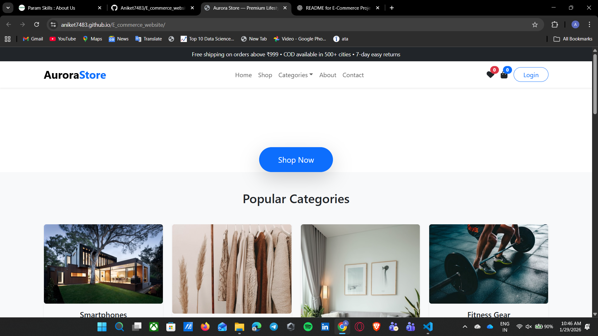

# 🛒 E-Commerce Website

A responsive and user-friendly **E-Commerce Website** built using **HTML, CSS, and JavaScript**.  
This project demonstrates core front-end development concepts such as layout design, styling, interactivity, and basic shopping functionality.

---

## 📸 Project Preview

> Add the screenshot of your website’s front page here 👇

---

## 🚀 Features

- Responsive homepage design  
- Product listing section  
- Add to cart functionality  
- Interactive UI using JavaScript  
- Clean and modern design  
- Fully front-end based (no backend)

---

## 🛠️ Tech Stack

- **HTML5** – Structure  
- **CSS3** – Styling & Layout  
- **JavaScript (ES6)** – Interactivity  

---

## 📂 Project Structure

